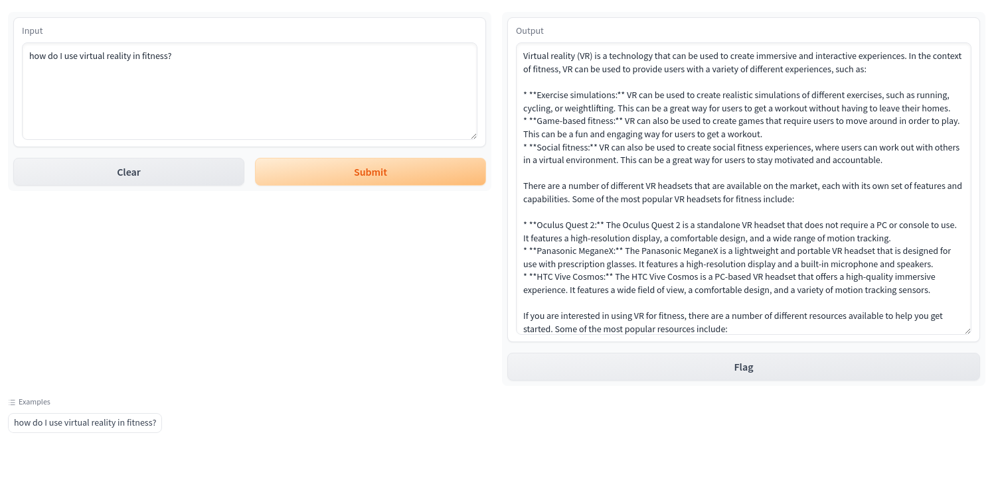

# Prediction With Custom Trained Model

This application provides a frontend for getting predictions from a custom
trained mode in Vertex AI.



## Deploying to GKE

### Setup Service Account

Compute service account is used by default. However, it's recommended to
use a separate service account for minimum permissions.

1. Enable required API

```bash
gcloud services enable compute.googleapis.com \
    container.googleapis.com
```

2. Set the environment vars based on your environment

```bash
export PROJECT_ID=<YOUR_PROJECT_ID>
export REGION=<YOUR_GCP_REGION_NAME>
```

3. Set up the cluster(optional)

```shell
gcloud container clusters create demo-gke-cluster --zone $REGION --num-nodes 1 --project $PROJECT_ID

gcloud container clusters get-credentials demo-gke-cluster --zone $REGION --project $PROJECT_ID
```

4. Enable Workload Identity Federation(optional if the GKE Autopilot cluster is used).

Note that, for GKE Autopilot clusters Workload Identity Federation is already enabled by default.

```shell

gcloud container clusters update demo-gke-cluster \
    --zone=$REGION \
    --workload-pool=$PROJECT_ID.svc.id.goog

gcloud container node-pools update default-pool \
    --cluster=demo-gke-cluster \
    --zone=$REGION \
    --workload-metadata=GKE_METADATA
```

5. Create service account

```bash
export GCP_SA=prediction-app-sa@$PROJECT_ID.iam.gserviceaccount.com

gcloud iam service-accounts create prediction-app-sa \
    --description="Service account to test custom trained models" \
    --display-name="prediction-app-sa"
    
kubectl create serviceaccount prediction-app-k8s-sa

```

6. Add `aiplatform.user` role

```bash


gcloud projects add-iam-policy-binding $PROJECT_ID \
    --member="serviceAccount:$GCP_SA" \
    --role="roles/aiplatform.user"
```

7. Add `logging.logWriter` role

```shell
gcloud projects add-iam-policy-binding $PROJECT_ID \
    --member="serviceAccount:$GCP_SA" \
    --role="roles/logging.logWriter"
```

8. Authorize the GKE SA

```shell
gcloud iam service-accounts add-iam-policy-binding $GCP_SA \
    --role roles/iam.workloadIdentityUser \
    --member "serviceAccount:$PROJECT_ID.svc.id.goog[default/prediction-app-k8s-sa]"

kubectl annotate serviceaccount prediction-app-k8s-sa \
    --namespace default \
    iam.gke.io/gcp-service-account=$GCP_SA
```

### Build

Build the docker image with Cloud Build and upload the image to Artifact
Registry.

```shell
export AR_REPO=$PROJECT_ID-app-ar
export SERVICE_NAME=$PROJECT_ID-app-prediction
export APP_IMAGE=$REGION-docker.pkg.dev/$PROJECT_ID/$AR_REPO/$SERVICE_NAME

gcloud artifacts repositories create ${AR_REPO} \
    --location=$REGION \
    --repository-format=Docker

gcloud builds submit app --tag $APP_IMAGE
```

### Deploy

Get Vertex AI model endpoint.

```shell
export MODEL_DISPLAY_NAME=<your model display name>
export MODEL_ENDPOINT=`gcloud ai endpoints list \
--project="$PROJECT_ID" \
--region="$REGION" \
--filter="DISPLAY_NAME: $MODEL_DISPLAY_NAME" \
--sort-by=~creationTimestamp \
--limit=1 \
--format="flattened(name)" \
| awk '{print $2}' | tr -d '\n'`
```

Deploy `prediction-app` to the `demo-gke-cluster` GKE cluster.

```shell
cat <<EOF > app/pod.yaml 
apiVersion: v1
kind: Pod
metadata:
  name: prediction-app
  namespace: default
spec:
  containers:
  - name: prediction-app
    image: $APP_IMAGE:latest
    imagePullPolicy: Always
    args:
    - python
    - "app.py"
    - "--project-id=$PROJECT_ID"
    - "--location=$REGION"
    - "--endpoint=$MODEL_ENDPOINT"
    ports:
    - containerPort: 7860 # Or the port on which your web app listens
  serviceAccountName: prediction-app-k8s-sa
  nodeSelector:
    iam.gke.io/gke-metadata-server-enabled: "true"
EOF

kubectl apply -f app/pod.yaml
```

### Test

Use Port Forwarding to Access Applications in a Cluster

```shell
kubectl port-forward prediction-app 7860:7860
```

Open the below link in your browser

http://127.0.0.1:7860
